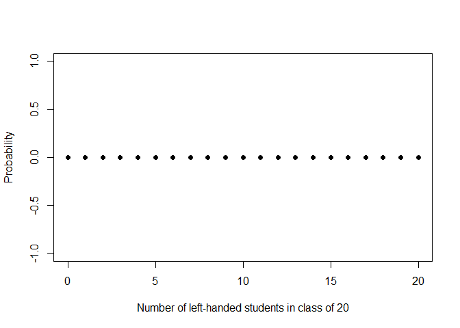
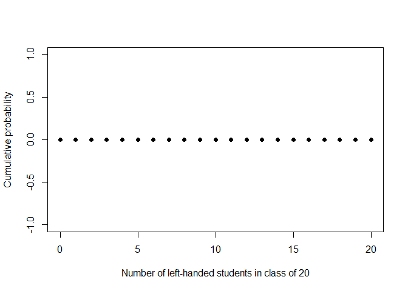
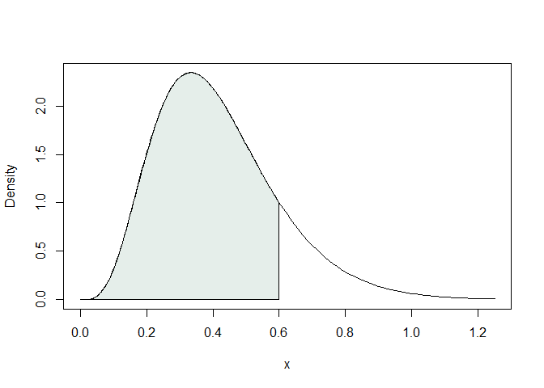

# Question 1

It is believed that about 11% of the population is left-handed. Generate
a plot of the probability mass function for number of left-handed
students in a class of 20.

::: cell
``` {.r .cell-code}
x <- 0:20
p <- rep(0,21) # something else goes here
plot(x,p, xlab = "Number of left-handed students in class of 20", ylab = "Probability", pch = 16)
```

::: cell-output-display

:::
:::

# Question 2

Continuing from question 1, generate a plot of the cumulative
probability function.

::: cell
``` {.r .cell-code}
x <- 0:20
cp <- rep(0,21) # something else goes here
plot(x,cp, xlab = "Number of left-handed students in class of 20", ylab = "Cumulative probability", pch = 16)
```

::: cell-output-display

:::
:::

# Question 3

Continuing from question 1, what is probability of 4 or more left-handed
students in a class of size 20?

# Question 4

Suppose a researcher is interested in enrolling 5 left-handed
individuals into a study. Let $M$ be the number of individuals the
researcher must approach in order to contact 5 left-handed individuals.

Generate a plot of the pmf of $M$.

# Question 5

Continuing question 4, generate a plot of the cdf of $M$.

# Question 6

Continuing question 4, the research only has funds to contact upto 60
individuals. What is the probability that the researcher will contact 5
left-handed individuals before funds are depleated?

# Question 7

Continuing question 4, on average, how many individuals will the
researcher need to screen in order to contact 5 left-handed individuals?

# Question 8

Suppose infant birthweights are distributed normally with mean 3055
grams and standard deviation of 753 grams. If an infant is the 98-th
percentile for weight, what is the weight of the infant in grams?

# Question 9

The world health organization defines the threshold for low birth weight
at 2500 grams. What proportion of infants are low birth weight, assuming
the distribution from question 8?

# Question 10

Generate a plot of the birthweight density function, shading the region
under the curve which corresponds to low birthweight infants.

HINT: The following code shows how to shade the region from 0 to 0.6
under the gamma density curve with the `polygon` command.

::: cell
``` {.r .cell-code}
curve(dgamma(x, 5, 12), 0, 1.25, ylab = "Density")
x <- seq(0, 0.6, length=200)
y <- dgamma(x, 5, 12)
polygon(c(0,x,0.6), c(0,y,0), col = "#abcabc50")
```

::: cell-output-display

:::
:::
